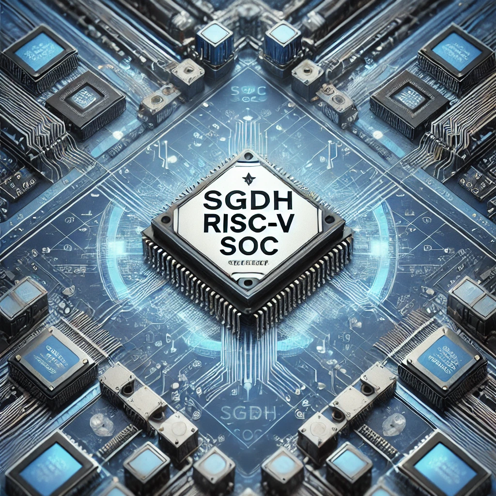
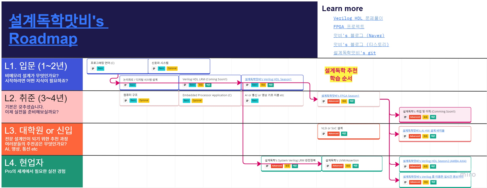

# [🌍 Who We Are?](https://semisgdh.com/)

# 🚀 SGDH's Awesome RISC-V Open Source Project (SGDH-RVSOC)

  

<!--

-->

# [📖 SGDH's Awesome Lecture Roadmap](https://miro.com/app/board/uXjVP9MN5ws=/)
| Lecture       | Description                        | Level    |
|---------------|------------------------------------|-----------|
| 설계독학맛비's 실전 Verilog HDL Season 0 (Language Reference Manual 완전정복) - Comming Soon 25Y 1Q   | [Verilog LRM 2001](https://picture.iczhiku.com/resource/eetop/WyKEdIyHgLhiwNmV.pdf) 문서를 직접 분석하여 만든 실무 중심의 문법강의. 어중간하게 배우지 말고 이 강의 하나로 끝내요.     | L0 초급 강의 (대학교 1~2학년)  |
| [설계독학맛비's 실전 Verilog HDL Season 1 (Clock부터 Internal Memory까지)](https://inf.run/Ma3a)    | Verilog HDL 문법 공부 이후의 현업에 입문하기 위한 강의  | L1 초급 강의 (대학교 1~2학년)  |
| [설계독학맛비's 실전 FPGA를 이용한 HW 가속기 설계 (LED 제어부터 Fully Connected Layer 가속기 설계까지)](https://inf.run/Q13B)     | Verilog HDL Season1 에서 배운 코드를 FPGA 에 올려보면서 설계의 즐거움을 느낄 수 있는 강의     | L2 중급 강의 (대학교 3~4학년)  |
| [설계독학맛비's 실전 AI HW 설계를 위한 바이블, CNN 연산 완전정복 (Verilog HDL + FPGA 를 이용한 가속기 실습)](https://inf.run/1mFx)     | AI HW 를 시작해야하는 사람들을 위한 기초 강의     | L3 중급 강의 (대학원, 현업 신입)  |
| [설계독학맛비's 실전 Verilog HDL Season 2 (AMBA AXI4 완전정복)](https://inf.run/R7R4)     | 현업 설계자라면 꼭 알아야하는 AMBA 를 공부하면서 System 을 이해하고 DMA (Direct Memory Access) 를 설계하는 강의    | L4 고급 강의 (현업 4년차 이상의 수준)  |

# 💻 SGDH's Awesome Challenge. HDLBits
- [🎬Youtube](https://www.youtube.com/playlist?list=PLm4EZB3VG6zm829pwH7RfD8CXufNHxEbi)
- [🔧Git SGDH_HDL_Bits](https://github.com/semisgdh/SGDH_HDL_Bits)

<!--

  

-->

<!--

**Here are some ideas to get you started:**

🙋‍♀️ A short introduction - what is your organization all about?
🌈 Contribution guidelines - how can the community get involved?
👩‍💻 Useful resources - where can the community find your docs? Is there anything else the community should know?
🍿 Fun facts - what does your team eat for breakfast?
🧙 Remember, you can do mighty things with the power of [Markdown](https://docs.github.com/github/writing-on-github/getting-started-with-writing-and-formatting-on-github/basic-writing-and-formatting-syntax)
-->
